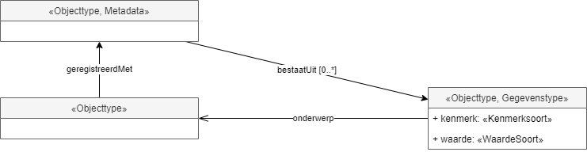
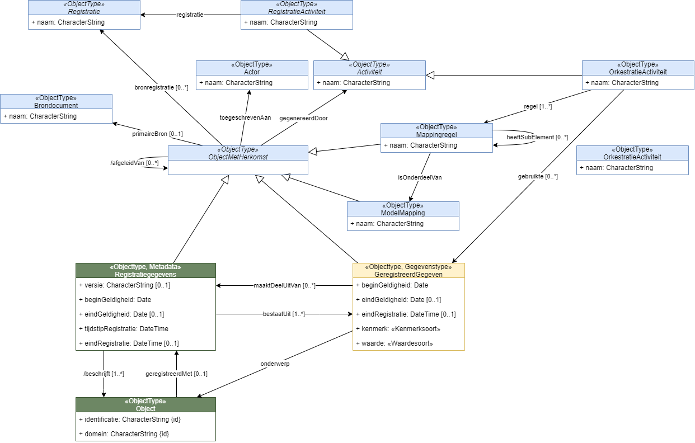
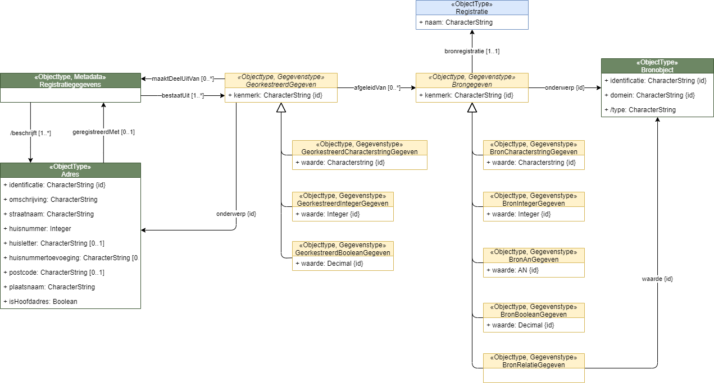

# Modellering van herkomst van georkestreerde modellen

## Een (meta)model voor het modelleren gegevens als object

* In een georkestreerde uitwisseling kan de herkomst van elk gegeven uit een informatieobject verschillen. We willen gegevens dan ook modelleren als objecten zodat we de herkomst ervan weer als gegevens kunnen uitwisselen. Metadata op gegevensniveau.
* We willen metadata opnemen zonder dat dit invloed heeft op het model van het objecttype.
  * Deze moet alleen directe eigenschappen van het type object modelleren om een zo herkenbaar mogelijke representatie te hebben van een objecttype in een UoD. Het vermengen van metakenmerken en objectkenmerken is een antipatroon voor het realiseren van samenhang.
  * We willen ook het objecttype zonder metadata kunnen uitwisselen omdat dit hetgeen is waar de meeste gebruikers in geinteresseerd zijn.
* Waarom een model voor gegevenstypen? We willen dit generiek maken zodat we dit als generiek patroon kunnen toepassen op alle objecttypen.
* Waarom een metamodel? Als we op metamodel (M2) niveau definieren hoe Objecttype en Gegevenstype zich tot elkaar verhouden dan kan het model en de instanties van de gegevenstypes afgeleid worden uit een instantie van een objecttype.
  
  Eenzelfde stap wordt in de RDF wereld momenteel ook gezet met [RDF-star](https://w3c.github.io/rdf-star/cg-spec)

Schets metamodel:


## Generiek model herkomst

* Gebaseerd op [PROV](https://www.w3.org/TR/prov-overview/) standaard
* Kan zeer specifieke herkomst / audit trail uitdrukken (combinatie technische en functionele herkomst)
* Kan ook relatief versimpeld toegepast worden.
* Uiteindelijk zullen we een standaardinvulling van dit model moeten realiseren die toegepast kan worden door orkestratie-implementaties.

Een eerste schets:



## Herkomst (simpel) voor productmodel Adres

Een beperkte, en dus simpele, invulling van het generieke herkomstmodel voor het productmodel Adres.

We nemen hier op dat een gegeven uit het Adres model afgeleid kan zijn uit een ander gegeven. 
Van dat andere gegeven kunnen we de bronregistratie opnemen.
Van dat andere gegeven weten we ook wat het onderwerp, diens identificatie en type (afgeleid gegeven) is.



Een data voorbeeld op basis van dit model:

```json
{
  // de directe eigenschappen van het adres
  "identificatie": "0200200000075716",
  "domein": "NL.ADR",
  "huisnummer": 701,
  "postcode": "7334DP",
  "straatnaam": "Laan van Westenenk",
  "plaatsnaam": "Apeldoorn",
  "isHoofdadres": true,

  // Binding naar informatieobjectgegevens / registratiegegevens
  // Dit zal in een normale uitwisseling niet uitgewisseld worden, of apart opvraagbaar zijn.
  "geregistreerdMet": {
    "bestaatUit": [
      {
        "onderwerp": {
          "identificatie": "0200200000075716",
          "domein": "NL.ADR"
        },
        "kenmerk": "identificatie",
        "waarde": "0200200000075716",
        // herkomst van het gegeven
        "afgeleidVan": [
          {
            "onderwerp": {
              "identificatie": "0200200000075716",
              "domein": "NL.IMBAG.NUM",
              "type": "Nummeraanduiding" 
            },
            "kenmerk": "identificatie",
            "waarde": "0200200000075716",
            "bronregistratie": [
              {
                "naam": "BAG"
              }
            ]
          }
        ]
      },
      {
        "onderwerp": {
          "identificatie": "0200200000075716",
          "domein": "NL.ADR"
        },
        "kenmerk": "domein",
        "waarde": "NL.ADR",
        // herkomst van het gegeven
        "afgeleidVan": [
          {
            "onderwerp": {
              "identificatie": "0200200000075716",
              "domein": "NL.IMBAG.NUM",
              "type": "Nummeraanduiding" 
            },
            "kenmerk": "domein",
            "waarde": "NL.IMBAG.NUM",
            "bronregistratie": [
              {
                "naam": "BAG"
              }
            ]
          }
        ]
      },
      {
        "onderwerp": {
          "identificatie": "0200200000075716",
          "domein": "NL.ADR"
        },
        "kenmerk": "huisnummer",
        "waarde": 701,
        // herkomst van het gegeven
        "afgeleidVan": [
          {
            "onderwerp": {
              "identificatie": "0200200000075716",
              "domein": "NL.IMBAG.NUM",
              "type": "Nummeraanduiding" 
            },
            "kenmerk": "huisnummer",
            "waarde": 701,
            "bronregistratie": [
              {
                "naam": "BAG"
              }
            ]
          }
        ]
      },
      {
        "onderwerp": {
          "identificatie": "0200200000075716",
          "domein": "NL.ADR"
        },
        "kenmerk": "straatnaam",
        "waarde": "Laan van Westenenk",
        // herkomst van het gegeven
        "afgeleidVan": [
          {
            "onderwerp": {
              "identificatie": "0200300022472362",
              "domein": "NL.IMBAG.OPR",
              "type": "OpenbareRuimte" 
            },
            "kenmerk": "naam",
            "waarde": "Laan van Westenenk",
            "bronregistratie": [
              {
                "naam": "BAG"
              }
            ]
          }
        ]
      },
      {
        "onderwerp": {
          "identificatie": "0200200000075716",
          "domein": "NL.ADR"
        },
        "kenmerk": "plaatsnaam",
        "waarde": "Apeldoorn",
        // herkomst van het gegeven
        "afgeleidVan": [
          {
            "onderwerp": {
              "identificatie": "3560",
              "domein": "NL.IMBAG.WPL",
              "type": "Woonplaats" 
            },
            "kenmerk": "naam",
            "waarde": "Apeldoorn",
            "bronregistratie": [
              {
                "naam": "BAG"
              }
            ]
          }
        ]
      },
      {
        "onderwerp": {
          "identificatie": "0200200000075716",
          "domein": "NL.ADR"
        },
        "kenmerk": "isHoofdadres",
        "waarde": true,
        // herkomst van het gegeven
        "afgeleidVan": [
          {
            "onderwerp": {
              "identificatie": "0200010000130331",
              "domein": "NL.IMBAG.VBO",
              "type": "Verblijfsobject" 
            },
            "kenmerk": "hoofdadres",
            "waarde": {
              "onderwerp": {
                "identificatie": "0200200000075716",
                "domein": "NL.IMBAG.NUM",
                "type": "Nummeraanduiding"
              }
            },
            "bronregistratie": [
              {
                "naam": "BAG"
              }
            ]
          }
        ]
      }
    ]
  }
}
```