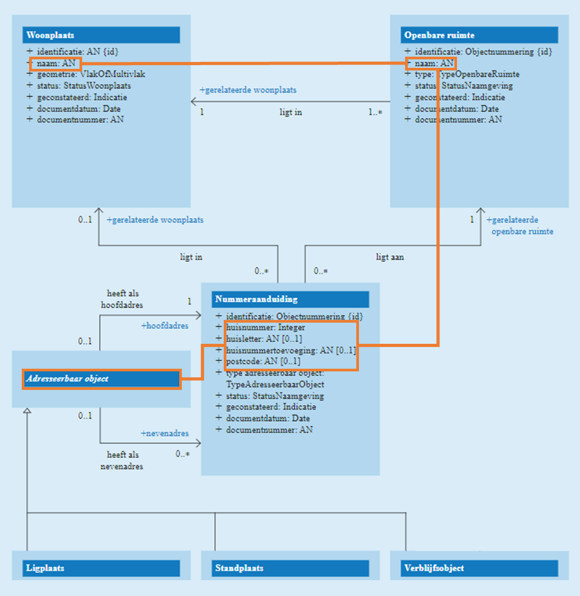

Use Case: Request address
=========================

Introduction
------------

If you want to retrieve a coherent address of an addressable object
(Verblijfsobject, Standplaats, Ligplaats) from the BAG, you need four object
types:

1.  the object Verblijfsobject, Standplaats, Ligplaats for the ID and possibly
    the location,

2.  the related object Nummeraanduidingreeks for the postcode and house number
    (possibly with additions),

3.  the related object Openbare ruimte for the street name and

4.  the related object Woonplaats for the place of residence.

The orange route in the image takes you from the addressable objects in the BAG
to the last item of an address in the BAG, the place of residence.

For this route we make a compact coherent semantic model Address. We then
specify the translation of the necessary object data in the BAG to the product
model Address. The translation specification is the basis for the registration's
orchestration. We test the connection between registration and orchestration
layer and the operation of the orchestration itself with demo software.

User story
----------

We use the following user story:

*As* user

*I want to* request a current and complete address of an individual object,

*so that I* don't have to compile this myself from several objects in the BAG
(Nummeraanduidingreeks, Openbare ruimte, and Woonplaats)

Principles
----------

For this use case we use the following principles:

-   A user can only request current addresses. An address includes secondary
    addresses.

-   We distinguish between a main address and a secondary address when answering
    a question about the user's address.

-   An address is selected based on the original identifier in the BAG (Filter
    on object identifier from Numeral designator range). A ObjectIdentifier
    (Objectnummering) is included in the "has as main address" or "has as
    secondary address" relationship of an Addressable Object in the BAG.

-   An address can be selected based on a specific characteristic (filter by
    attribute), for example a selection of addresses based on street name, zip
    code or place of residence.

Out of scope
------------

We place the following topics out of scope (for now):

-   Non-current addresses, or history

-   Filtering addresses based on a property (Building/Pand) identifier (‘Give me
    all addresses in this specific property’)

-   Filtering addresses based on a geometry (bounding box).

Design Principles
-----------------

For the Address product model, we use the following design principles. The
design principles determine the modeling choices in the model.

-   An address is considered a subject (Onderwerp) in this project model.

-   Each subject is composed of one or more orchestration data, or in other
    words: an orchestration data is part of a subject.

-   The origin of an orchestrated data must be explicitly recorded per data. An
    orchestration data (Orkestratiegegeven) is derived from one or more source
    data (Brongegeven).

-   A source data (Brongegeven) belongs to a source object (Bronobject) and
    originates from a source registration (Bronregistratie).

-   An address is a main or secondary address, and is included with an
    isMainAddress (isHoofdAdres) yes/no property as the Address property.

-   Geometry is not part of the Address. Addressable objects and Building (Pand)
    have a geometry, but they are not part of the Address product model.

-   A specific data type of the source data may be converted to a general type
    (eg AN in the BAG to CharacterString in the Address product model).
    Validation is not applicable, so there is no need to restrict a
    CharacterString, for example.

-   The data types of attribute value of Orkestratiegegeven and Brongegeven are
    now included as an option for the readability and simplicity of the Address
    project model.

N.B. When linking to other source registrations, this Union class must be
expanded. To be further determined to what extent this is workable, also in
relation to data type objects as a subtype of Orkestratiegegeven and Brongegeven
(see Generic Modeling Patterns)

Implementation 
------------------

### Objecttype Adres

For objecttype Adres an attribute value is filled with a value, which
corresponds to a attribute value of a BAG objecttype according to the following
table.

| **Productmodel Adres** |                      |                      | **IMBAG**                                                                    |                            |                 |   |   |   |
|------------------------|----------------------|----------------------|------------------------------------------------------------------------------|----------------------------|-----------------|---|---|---|
| **objecttype**         | **attribuut**        | **datatype**         | **objecttype**                                                               | **attribuut**              | **datatype**    |   |   |   |
| Adres                  | identificatie        | CharacterString {id} | Nummeraanduiding                                                             | identificatie              | Objectnummering |   |   |   |
|                        | omschrijving         | CharacterString      |                                                                              |                            |                 |   |   |   |
|                        | huisnummer           | Integer              |                                                                              | huisnummer                 | Integer         |   |   |   |
|                        | huisletter           | CharacterString      |                                                                              | huisletter                 | AN              |   |   |   |
|                        | huisnummertoevoeging | CharacterString      |                                                                              | huisnummertoevoeging       | AN              |   |   |   |
|                        | postcode             | CharacterString      |                                                                              | postcode                   | AN              |   |   |   |
|                        |                      |                      |                                                                              | gerelateerdeOpenbareRuimte | Objectnummering |   |   |   |
|                        | straatnaam           | CharacterString      | Openbareruimte                                                               | naam                       | AN              |   |   |   |
|                        |                      |                      |                                                                              | gerelateerdeWoonplaats     | Objectnummering |   |   |   |
|                        | woonplaats           | CharacterString      | Woonplaats                                                                   | naam                       | AN              |   |   |   |
|                        | *isHoofdadres*       | *Boolean*            | *«Nummeraanduiding:identificatie» == «AdresseerbaarObject:gerelateerdAdres»* | *relatie*                  |                 |   |   |   |

Adres:omschrijving is composed by several attributes

-   name of BAG:OpenbareRuimte:naam,

-   followed by white space, followed by huisnummer of BAG:Nummeraanduiding,

-   possibly , followed by white space and huisnummertoevoeging of
    BAG:Nummeraanduiding,

-   possibly, followed by dash (-) and huisnummertoevoeging of
    BAG:Nummeraanduiding,

-   followed by comma and white space,

-   followed by postcode of BAG:Nummeraanduiding,

-   followed by two white spaces,

-   followed by naam of BAG:Woonplaats

For example:

“Barchman Wuytierslaan 10, 3818LH Amersfoort”

“Korenaarstraat 33 A-1, Nieuw-Vennep”

Regular expression:

\^(«BAG:OpenbareRuimte:naam»)(\\s)(«BAG:Nummeraanduiding:huisnummer»)(«BAG:Nummeraanduiding:huisletter»)(\\-)(«BAG:Nummeraanduiding:huisnummertoevoeging»)(,\\s)(«BAG:Nummeraanduiding:postcode»)(\\s\\s)(BAG:Woonplaats:naam)

### Objecttype Orkestratiegegeven

For objecttype Orkestratiegegeven the atttribute ‘kenmerk’ is filled with a
value which corresponds to the attribute value of objecttype Adress according to
the following table.

| **Productmodel Adres** |                      | **Productmodel Adres** |                |
|------------------------|----------------------|------------------------|----------------|
| **objecttype**         | **kenmerk**          | **objecttype**         | **attribuut**  |
| Orkestratiegegeven     | identificatie        | Adres                  | identificatie  |
|                        | omschrijving         |                        | omschrijving   |
|                        | huisnummer           |                        | huisnummer     |
|                        | huisletter           |                        | huisletter     |
|                        | huisnummertoevoeging | huisnummertoevoeging   |                |
|                        | postcode             |                        | postcode       |
|                        |                      |                        |                |
|                        | straatnaam           |                        | straatnaam     |
|                        |                      |                        |                |
|                        | woonplaats           |                        | woonplaats     |
|                        | *isHoofdadres*       |                        | *isHoofdadres* |
|                        |                      |                        |                |
|                        | **Bronregistratie**  | naam                   | «BAG»          |

### Objecttype Brongegeven

For objecttype Brongegeven the attribute ‘kenmerk’ is filled with a value which
corresponds to an attribute value of an BAG objecttype according to the
following table.

| **Productmodel Adres** |                            | **IMBAG**                                                                    |               |
|------------------------|----------------------------|------------------------------------------------------------------------------|---------------|
| **objecttype**         | **kenmerk**                | **objecttype**                                                               | **attribuut** |
| Brongegeven            | identificatie              | Nummeraanduiding                                                             | identificatie |
|                        |                            |                                                                              |               |
|                        | huisnummer                 |                                                                              | huisnummer    |
|                        | huisletter                 |                                                                              | huisletter    |
|                        | huisnummertoevoeging       | huisnummertoevoeging                                                         |               |
|                        | postcode                   |                                                                              | postcode      |
|                        | gerelateerdeOpenbareRuimte | gerelateerdeOpenbareRuimte                                                   |               |
|                        | naam                       | Openbareruimte                                                               | naam          |
|                        | gerelateerdeWoonplaats     | gerelateerdeWoonplaats                                                       |               |
|                        | naam                       | Woonplaats                                                                   | naam          |
|                        | *gerelateerdAdres*         | *«Nummeraanduiding:identificatie» == «AdresseerbaarObject:gerelateerdAdres»* |               |

#### Assocation Orkestratiegegeven is afgeleid uit Brongegeven

For objecttype Orkestratiegegeven the association relation ‘is derived from’
(‘is afgeleid van’) of one of more Brongegevens is obtained according tot the
following table.

| **Productmodel Adres** |                      | **Productmodel Adres** |                            |
|------------------------|----------------------|------------------------|----------------------------|
| **objecttype**         | **kenmerk**          | **objecttype**         | **kenmerk**                |
| Orkestratiegegeven     | identificatie        | Brongegeven            | identificatie              |
|                        | omschrijving         |                        |                            |
|                        | huisnummer           |                        | huisnummer                 |
|                        | huisletter           |                        | huisletter                 |
|                        | huisnummertoevoeging |                        | huisnummertoevoeging       |
|                        | postcode             |                        | postcode                   |
|                        |                      |                        | gerelateerdeOpenbareRuimte |
|                        | straatnaam           |                        | naam                       |
|                        |                      |                        | gerelateerdeWoonplaats     |
|                        | woonplaats           |                        | naam                       |
|                        | *isHoofdadres*       |                        | *gerelateerdAdres*         |
