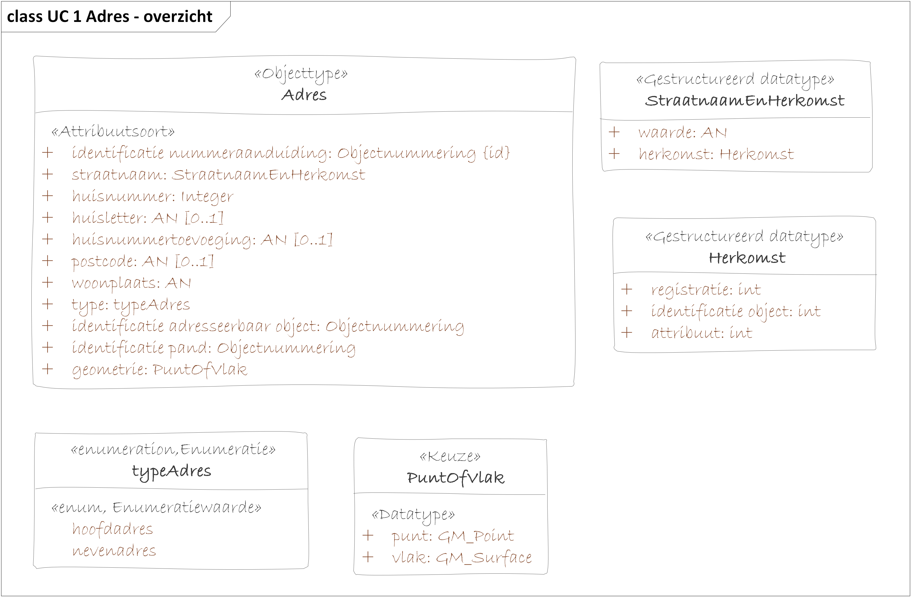

Use cases
=========

UC1 Opvragen adres
------------------

### User story

*Als* gebruiker

*wil ik* een actueel adres opvragen van een individueel object of binnen een
gebied,

*zodat ik* dit niet zelf hoef samenstellen uit meerdere objecten in de BAG
(Nummeraanduiding, OpenbareRuimte en Woonplaats).

### Uitgangspunten

-   Adres is inclusief nevenadressen.

-   Onderscheid maken tussen hoofdadres en nevenadres bij beantwoorden vraag van
    gebruiker.

-   Opvragen van actueel adres een specifiek invidueel Verblijfsobject,
    Standplaats of Ligplaats.

-   Opvragen van alle actuele adressen in een gebouw, zijnde een Pand.

-   Opvragen alle adressen met bepaalde straatnaam, postcode, woonplaats.

-   Opvragen van actuele adressen binnen een gebied.

### Modelleerkeuzes

-   T.b.v. vraag “Geef mij het adres van het adresseerbaar object met dit ID.”

-   Daarvoor is nodig dat het ID van het adresseerbare object is opgenomen als
    eigenschap van het Adres. Dit adres hoort bij dit Adresseerbaar object
    middels ID.

-   Idem voor Pand, opnemen id pand als eigenschap van Adres.

-   Opnemen typeAdres als eigenschap van Adres voor onderscheid hoofdadres en
    nevenadres.

### Openstaande vragen

-   Nemen we ook de Adresseerbare objecten + Pand op in model? Is dat nodig, of
    wordt via BAG service geleverd, en hoeft het niet in dit productmodel.

>   Afbeelding met tekst Automatisch gegenereerde beschrijving
