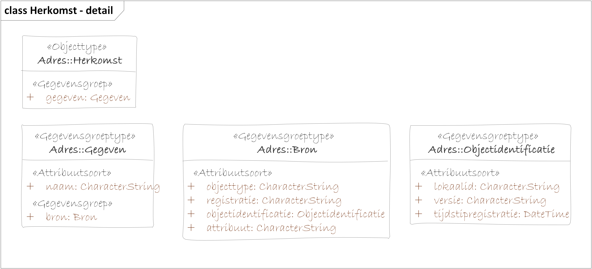

Use cases
=========

UC1 Opvragen adres
------------------

### User story

*Als* gebruiker

*wil ik* een actueel adres opvragen van een individueel object of binnen een
gebied,

*zodat ik* dit niet zelf hoef samenstellen uit meerdere objecten in de BAG
(Nummeraanduiding, OpenbareRuimte en Woonplaats).

### Uitgangspunten

-   Adres is inclusief nevenadressen.

-   Onderscheid maken tussen hoofdadres en nevenadres bij beantwoorden vraag van
    gebruiker.

-   Filter op ID: Opvragen van actueel adres van een specifiek invidueel
    Verblijfsobject, Standplaats of Ligplaats via het ID van de
    Nummeraanduiding.

-   Filter op attribuut: Opvragen alle actuele adressen met bepaalde straatnaam,
    postcode, woonplaats.

### Buiten scope

-   niet-actuele adressen, ofwel historie

-   Filter op PandID: Opvragen van alle actuele adressen in een gebouw, zijnde
    een Pand.

-   Filter op geometrie: Opvragen van actuele adressen binnen een gebied.

### Modelleerkeuzes

-   Opnemen isHoofdadres als eigenschap van Adres voor onderscheid hoofdadres en
    nevenadres.

-   Adresseerbare objecten en Pand vormen geen onderdeel van productmodel.

-   Herkomst wordt apart van klasse Adres gemodelleerd.

Model

JSON voorbeeld
--------------

{

"adres": {

"identificatie": "0307200000456181",

"omschrijving": "Barchman Wuytierslaan 10, 3818LH Amersfoort",

"straat": "Barchman Wuytierslaan",

"huisnummer": "10",

"huisletter": null,

"huisnummertoevoeging": null,

"postcode": "3818LH",

"plaats": "Amersfoort",

"_metadata": {

"herkomst": {

"gegeven.1": {

"naam": "identificatie",

"bron": {

"registratie": "BAG",

"objecttype": "Nummeraanduiding",

"object identificatie": {

"lokaalid": "03070201234567890123456",

"versie": "1",

"tijdstipregistratie": "21-01-2010"

},

"attribuut": "identificatie"

}

},

"gegeven.2": {

"naam": "omschrijving",

"bron.1": {

"registratie": "BAG",

"objecttype": "Nummeraanduiding",

"object identificatie": {

"lokaalid": "0307200000456181",

"versie": "1",

"tijdstipregistratie": "21-01-2010"

},

"attribuut.1": "huisnummer",

"attribuut.2": "huisletter",

"attribuut.3": "huisnummertoevoeging",

"attribuut.4": "postcode"

},

"bron.2": {

"registratie": "BAG",

"objecttype": "OpenbareRuimte",

"object identificatie": {

"lokaalid": "0307200000456181",

"versie": "1",

"tijdstipregistratie": "21-01-2010"

},

"attribuut": "naam"

}

},

"gegeven.3": {

"naam": "straat",

"bron": {

"registratie": "BAG",

"objecttype": "OpenbareRuimte",

"object identificatie": {

"lokaalid": "0307300000306765",

"versie": "1",

"tijdstipregistratie": "21-01-2010"

},

"attribuut": "naam"

}

},

"gegeven.4": {

"naam": "huisnummer",

"bron": {

"registratie": "BAG",

"objecttype": "Nummeraanduiding",

"object identificatie": {

"lokaalid": "0307200000456181",

"versie": "1",

"tijdstipregistratie": "21-01-2010"

},

"attribuut": "huisnummer"

}

},

"gegeven.5": {

"naam": "huisletter",

"bron": {

"registratie": "BAG",

"objecttype": "Nummeraanduiding",

"object identificatie": {

"lokaalid": "0307200000456181",

"versie": "1",

"tijdstipregistratie": "21-01-2010"

},

"attribuut": "huisletter"

}

},

"gegeven.6": {

"naam": "huisnummertoevoeging",

"bron": {

"registratie": "BAG",

"objecttype": "Nummeraanduiding",

"object identificatie": {

"lokaalid": "0307200000456181",

"versie": "1",

"tijdstipregistratie": "21-01-2010"

},

"attribuut": "huisnummertoevoeging"

}

},

"gegeven.7": {

"naam": "postcode",

"bron": {

"registratie": "BAG",

"objecttype": "Nummeraanduiding",

"object identificatie": {

"lokaalid": "0307200000456181",

"versie": "1",

"tijdstipregistratie": "21-01-2010"

},

"attribuut": "postcode"

}

},

"gegeven.8": {

"naam": "plaats",

"bron": {

"registratie": "BAG",

"objecttype": "Woonplaats",

"object identificatie": {

"lokaalid": "1664",

"versie": "4",

"tijdstipregistratie": "24-10-2019"

},

"attribuut": "postcode"

}

},

"gegeven.9": {

"naam": "isHoofdadres",

"bron": {

"registratie": "BAG",

"objecttype": "Verblijfsobject",

"object identificatie": {

"lokaalid": "0307010000456182",

"versie": "3",

"tijdstipregistratie": "12-10-2015"

},

"relatie.1": "hoofdadres",

"relatie.2": "nevenadres"

}

}

}

}

}

}
