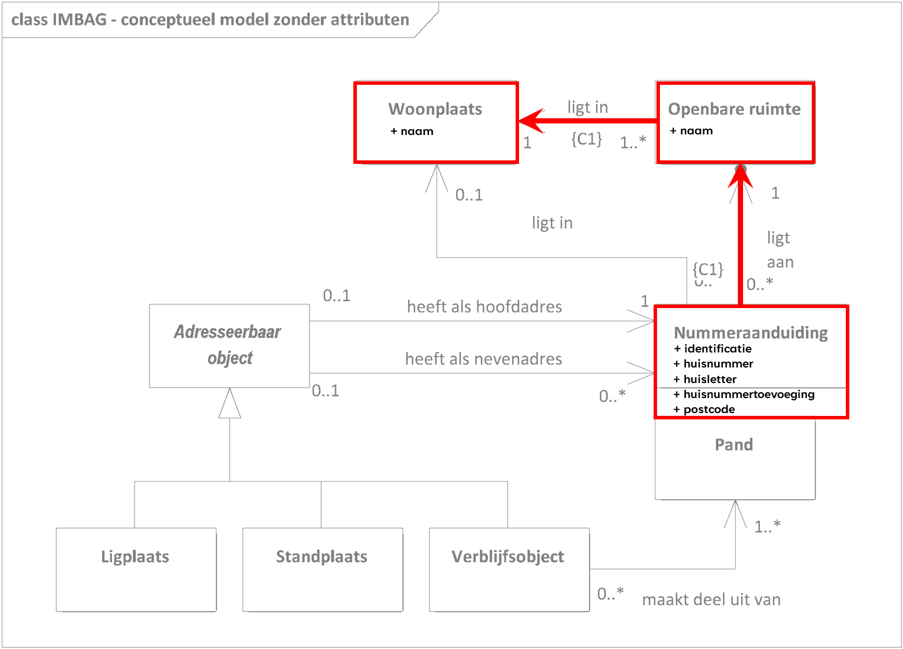

Vertaalspecificaties
====================

UC1 Adres
---------

Een adres bestaat uit een samenstelling van attribuutwaarden van 3 IMBAG
objecttypen: Nummeraanduidingreeks, Openbareruimte en Woonplaats.

De relatie tussen de attributen van IMBAG en het Productmodel Adres staat
hieronder gespecificieerd.

| IMBAG                 |                              | PM Adres |                      |
|-----------------------|------------------------------|----------|----------------------|
| Nummeraanduidingreeks | identificatie                | Adres    | identificatie        |
|                       | huisnummer                   |          | huisnummer           |
|                       | huisletter                   |          | huisletter           |
|                       | huisnummertoevoeging         |          | huisnummertoevoeging |
|                       | postcode                     |          | postcode             |
|                       | *gerelateerdeOpenbareRuimte* |          |                      |
| Openbareruimte        | naam                         |          | straatnaam           |
|                       | *gerelateerdeWoonplaats*     |          |                      |
| Woonplaats            | naam                         |          | woonplaats           |
